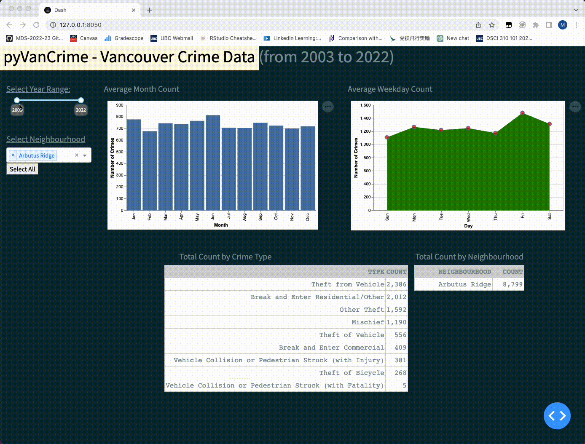

# pyVanCrime

## Overview

Thank you for visiting the `pyVanCrime` app project repository. This repository hosts the dashboard for the Vancouver (Canada) crime data released by the Vancouver Police Department ([VPD](https://vpd.ca/)). This information, which spans 2003 through 2022, is public domain and is licensed under [CC0](https://creativecommons.org/publicdomain/zero/1.0/).

This README file serves as a central location for the project's documentation. You may either go directly to a subsection of interest or continue reading to learn more.

* [What is this app about?](#what-is-this-app-about)
* [Usage](#usage)
* [How to get involved and contribute?](#how-to-get-involved-and-contribute)
* [Getting started](#getting-started)
* [License](#license)
* [Credits](#credits)
* [Quick Links](#quick-links)

## What is this app about ?

This is a Dash app for the [Data Visualization II](https://ubc-mds.github.io/course-descriptions/DSCI_532_viz-2/) individual project.

In a nutshell, this is a dashboard application that helps users and interested parties visualize Vancouver crime data, publicly released by the Vancouver Police Department ([VPD](https://vpd.ca/)). The information will be arranged in a manner that takes into account the different types of criminal behavior, as well as the time periods and neighbourhoods involved. It is important to note that the purpose of this dashboard is not to label any specific area of Vancouver with a negative connotation, but rather to educate. For a detailed description of the motivation, description, and usage scenarios, please visit [Proposal](reports/proposal.md).

## Usage

The program follows a conventional dashboard layout in which the user can select or specify the scope of what they need to visualize on the left side, and a set of relevant visualization components that update in response to the user's selection criteria on the right.

Here's a link to the live [application](https://dash-app-pyvancrime.onrender.com/) if you like to check it out.

There are four visulization components in total: <br>
1. Average number of crimes by month - Bar plot
2. Average number of crimes by weekday - Area plot
3. Breakdown by crime type - Table
4. Breakdown by neighbourhood - Table



User can make use of the widgets on the left to narrow down the scope of search:

-   Filter the crime statistics by beginning and ending years to display it (in the convenient form of a slider).


-   Focus on a certain Vancouver neighbourhood by applying a filter (in the form of a multi-selection dropdown).
-   The dropdown supports typing for convenient search.
-   The handy `Select All` button allows user to select all Neighbourhood in one go.


## How to get involved and contribute ?

Anyone interested in improving this dashboard and take on some of the following tasks are especially welcome to get in touch. Areas for improvments are:

1.  Improve the performance of the dashboard
2.  Increase the visual components' degree of interaction.
3.  Add in more plots or tables.
4.  Enhance test suites by including coverage testing.

The next section will help you get started with that and guide you through the setup.

## Getting started

Interested in contributing? Check out the [contributing guidelines](CONTRIBUTING.md). Please note that this project is released with a Code of Conduct. By contributing to this project, you agree to abide by its terms.

To setup your development environment to contribute to `pyVanCrime` please follow these instructions below:

1.  Clone this [repository](https://github.com/markusnam/pyVanCrime) and create a development branch

    ``` console
    $ git switch -c name-of-your-contributing-branch
    ```

2.  Open `app.py` under the `src` folder with an IDE such as Jupyter Lab or Visual Studio Code.

3.  You're almost there. After editing `app.py`, type `python app.py` in a command prompt.

4.  Copy the link shown on the command prompt. (in this example, it is `http://127.0.0.1:8050/`)

    ``` console
    Dash is running on http://127.0.0.1:8050/

    * Serving Flask app 'app' (lazy loading)
    * Environment: production
    ...
    ```

5. Paste the link to a browser. This will launch `pyVanCrime` app

6.  Congratulations, you are now able to develop and contribute to the `pyVanCrime` dashboard application.

## License

`pyVanCrime` was created by Markus Nam. It is licensed under the terms of the [MIT license](LICENSE).


## Quick Links and References
-   [Vancouver (Canada) crime data released by the Vancouver Police Department](https://vpd.ca/)
-   [pyVanCrime Live Application](https://dash-app-pyvancrime.onrender.com/)
-   [Issues](https://github.com/markusnam/pyVanCrime/issues)
-   [Proposal](reports/proposal.md)
-   [Contributing Guidelines](CONTRIBUTING.md)
-   [Code of Conduct](CODE_OF_CONDUCT.md)
-   [License](LICENSE)
